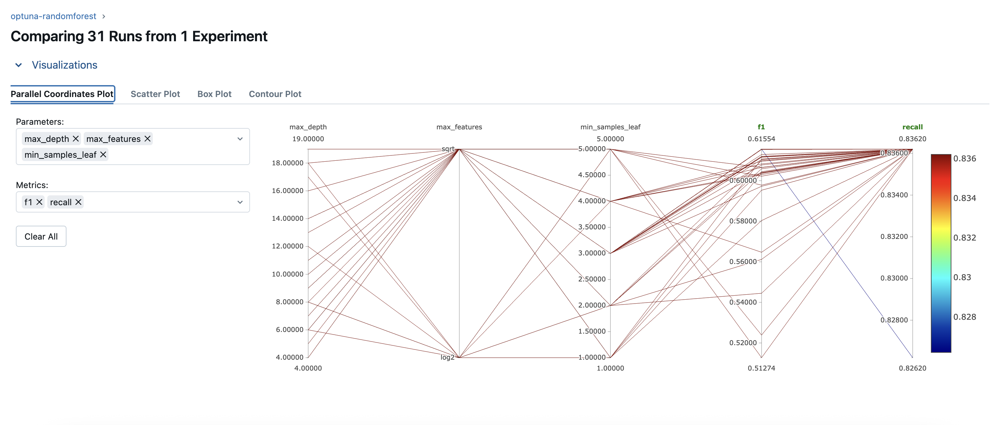
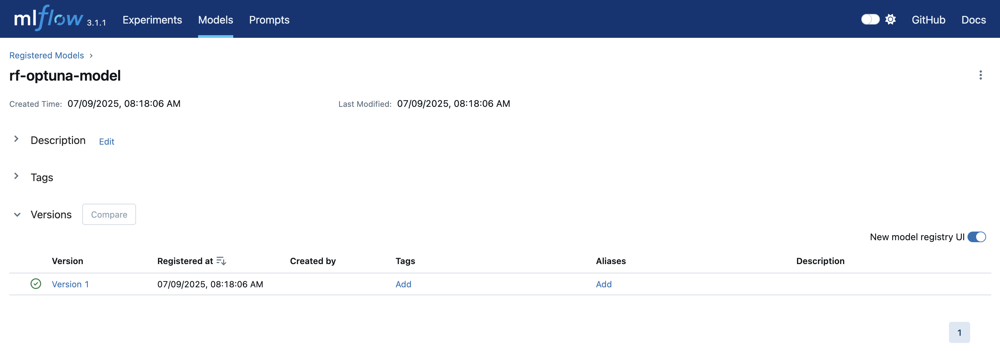
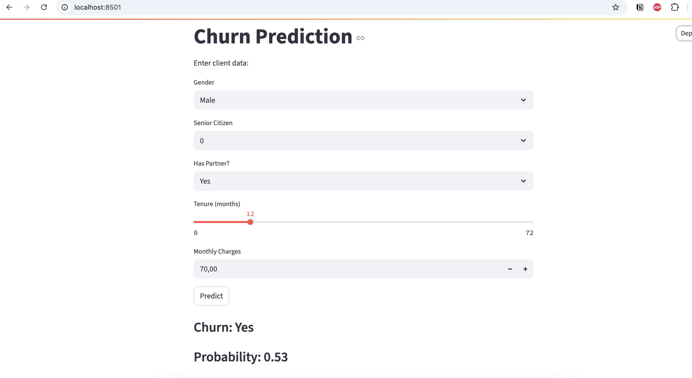
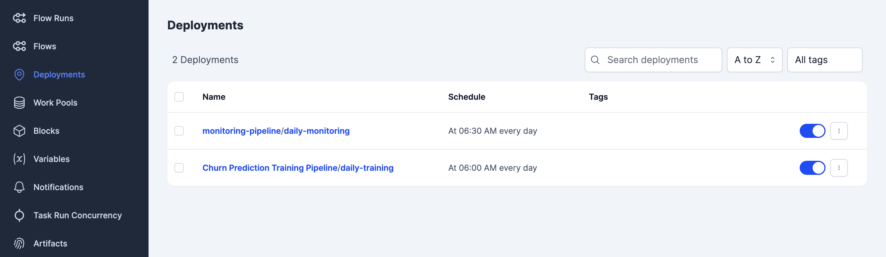
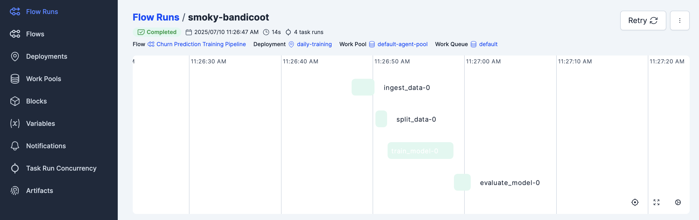
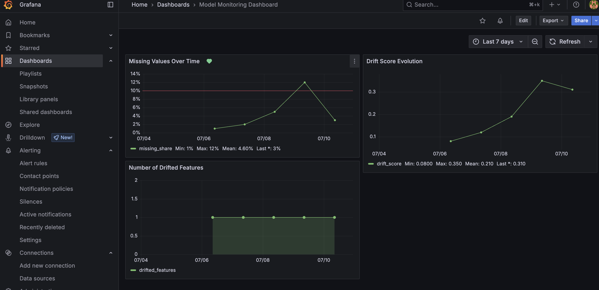
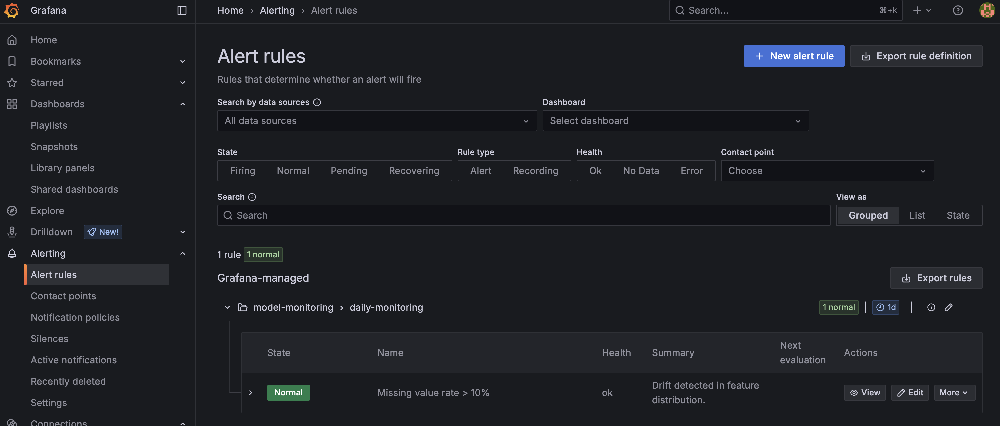

[](badges/coverage.svg)

# 📊 Customer Churn Prediction — MLOps Pipeline

A production-grade, end-to-end **MLOps pipeline** for predicting telecom customer churn. The system covers the full ML lifecycle: data versioning, multi-model hyperparameter tuning, ensemble training, experiment tracking, REST + UI deployment, drift monitoring, and automated retraining — all containerised and reproducible.

---

## Table of Contents

- [Problem Statement](#problem-statement)
- [Architecture Overview](#architecture-overview)
- [Setup & Usage](#setup--usage)
- [Cloud Deployment (Render)](#cloud-deployment-render)
- [Project Structure](#project-structure)
- [Data Processing](#data-processing)
- [Model Training & Selection](#model-training--selection)
- [Model Performance](#model-performance)
- [Experiment Tracking](#experiment-tracking)
- [Model Deployment](#model-deployment)
- [Orchestration](#orchestration)
- [Monitoring & Alerting](#monitoring--alerting)
- [Code Quality & CI/CD](#code-quality--cicd)
- [Potential Improvements](#potential-improvements)

---

## Problem Statement

Customer churn — the loss of clients or subscribers — is a critical business problem in telecommunications. Identifying customers likely to leave enables companies to take proactive retention actions such as targeted offers or personalised support.

This project builds a complete machine learning system that predicts customer churn from historical telecom data. The solution is end-to-end: from raw data ingestion and preprocessing, through multi-model parallel training and ensemble stacking, to REST API deployment and live data drift monitoring.

### Goal

Develop a **robust, reproducible, and self-healing** churn prediction system that:
- Identifies high-risk customers with a calibrated churn probability
- Explains predictions using SHAP feature importances
- Automatically retrains when data distribution drifts beyond acceptable thresholds

---

## Architecture Overview

```
┌─────────────────────────────────────────────────────────────────┐
│                        Data Layer                               │
│   Raw CSV (DVC) → Ingestion → Split (train / val / test)        │
└────────────────────────────┬────────────────────────────────────┘
                             │
┌────────────────────────────▼────────────────────────────────────┐
│                     Training Pipeline  (Prefect)                │
│  ┌──────────┐ ┌──────────┐ ┌─────────┐ ┌──────┐  parallel      │
│  │  LogReg  │ │    RF    │ │ XGBoost │ │ LGBM │  Optuna HPO    │
│  └────┬─────┘ └────┬─────┘ └────┬────┘ └──┬───┘               │
│       └────────────┴────────────┴──────────┘                   │
│                    ┌──────────────┐                             │
│                    │  MLP  ──────►  SoftVotingEnsemble          │
│                    └──────────────┘                             │
└────────────────────────────┬────────────────────────────────────┘
                             │
┌────────────────────────────▼────────────────────────────────────┐
│                      MLflow Registry                            │
│   Tracks all experiments · Registers all 6 models · SHAP logs  │
└───────┬──────────────────────────────────────┬──────────────────┘
        │                                       │
┌───────▼───────────┐               ┌───────────▼───────────────┐
│  Streamlit UI     │               │  FastAPI REST API          │
│  localhost:8501   │               │  /predict · /health ·      │
│  churn-streamlit  │               │  /reload · /docs           │
│  .onrender.com    │               │  churn-fastapi.onrender.com│
└───────────────────┘               └───────────────────────────┘
                             │
┌────────────────────────────▼────────────────────────────────────┐
│                  Monitoring Pipeline  (Prefect)                  │
│  Evidently Drift Report → PostgreSQL → Grafana Dashboards        │
│  Drift > 30%?  →  Auto-trigger Training Pipeline 🔄              │
│  Grafana Alert →  Email: arunpandi984353@gmail.com               │
└─────────────────────────────────────────────────────────────────┘
```

---

## Setup & Usage

### Prerequisites

- [Python 3.10+](https://www.python.org/downloads/)
- [Docker + Docker Compose](https://docs.docker.com/get-docker/)
- [Git](https://git-scm.com/)
- [Make](https://www.gnu.org/software/make/)

### Quick Start (Docker)

```bash
git clone https://github.com/maste21/MlOps-Pipeline-Churn-Prediction.git
cd MlOps-Pipeline-Churn-Prediction

# Start all services: MLflow, Prefect, Streamlit, FastAPI, Grafana, PostgreSQL
docker compose up -d
```

The `churn-prediction-app` container automatically runs the full startup sequence:
1. Trains all 5 base models with Optuna HPO → registers each in MLflow
2. Builds the Soft Voting Ensemble → registers as `ensemble-voting-model`
3. Saves the latest model locally (`models/model.pkl`) for zero-downtime fallback
4. Registers Prefect deployments (daily training + monitoring schedules)
5. Starts the Prefect agent
6. Launches the Streamlit inference UI

> ℹ️ Allow 3–5 minutes for the full training sequence. Ports `8501`, `8000`, `4200`, `5050`, and `3000` must be free.

### Service URLs

| Service        | URL                         | Credentials   |
|----------------|-----------------------------|---------------|
| Streamlit UI   | http://localhost:8501       | —             |
| FastAPI Docs   | http://localhost:8000/docs  | —             |
| MLflow UI      | http://localhost:5050       | —             |
| Prefect UI     | http://localhost:4200       | —             |
| Grafana        | http://localhost:3000       | admin / admin |
| Adminer (DB)   | http://localhost:8080       | —             |

### Local Development (without Docker)

```bash
# Install dependencies
pip install -r requirements.txt

# Run full ML pipeline
make all

# Start FastAPI
uvicorn src.inference.fastapi_app:app --host 0.0.0.0 --port 8000

# Start Streamlit
streamlit run src/inference/app.py

# Register Prefect deployments
make orchestration
```

### Makefile Commands

| Command              | Description                                      |
|----------------------|--------------------------------------------------|
| `make all`           | Full pipeline: ingest → split → train → evaluate |
| `make ingest`        | Download and preprocess raw data                 |
| `make split`         | Stratified train/val/test split                  |
| `make train_logreg`  | Train Logistic Regression with Optuna            |
| `make train_rf`      | Train Random Forest with Optuna                  |
| `make train_xgb`     | Train XGBoost with Optuna                        |
| `make train_lgbm`    | Train LightGBM with Optuna                       |
| `make train_mlp`     | Train MLP Neural Network with Optuna             |
| `make train_all`     | Train all 5 base models sequentially             |
| `make train_ensemble`| Build Soft Voting Ensemble from registry models  |
| `make evaluate`      | Evaluate ensemble on held-out test set           |
| `make test`          | Run pytest test suite                            |
| `make quality_checks`| Run black + isort + pylint                       |
| `make orchestration` | Apply Prefect deployments                        |

### API Usage (FastAPI)

**Health check:**
```bash
curl http://localhost:8000/health
```

**Churn prediction:**
```bash
curl -X POST http://localhost:8000/predict \
  -H "Content-Type: application/json" \
  -d '{
    "customerID": "1234-XYZ",
    "gender": "Female",
    "SeniorCitizen": 0,
    "Partner": "Yes",
    "Dependents": "No",
    "tenure": 12,
    "PhoneService": "Yes",
    "MultipleLines": "No",
    "InternetService": "Fiber optic",
    "OnlineSecurity": "No",
    "OnlineBackup": "Yes",
    "DeviceProtection": "No",
    "TechSupport": "No",
    "StreamingTV": "Yes",
    "StreamingMovies": "No",
    "Contract": "Month-to-month",
    "PaperlessBilling": "Yes",
    "PaymentMethod": "Electronic check",
    "MonthlyCharges": 70.35,
    "TotalCharges": 820.50
  }'
```

**Response:**
```json
{
  "churn": 1,
  "churn_label": "Churn",
  "probability": 0.6265,
  "no_churn_probability": 0.3735,
  "top_features": {
    "num__tenure": 0.1823,
    "num__MonthlyCharges": 0.1541,
    "cat__Contract_Month-to-month": 0.1102
  },
  "model_version": "mlflow://ensemble-voting-model/v2"
}
```

**Reload model:**
```bash
curl http://localhost:8000/reload
```

---

## Cloud Deployment (Render)

The Streamlit UI and FastAPI are deployed to [Render](https://render.com/) via `render.yaml`. Deployments are automatically triggered on every push to `main`.

| Service        | Public URL                                         |
|----------------|----------------------------------------------------|
| Streamlit UI   | https://churn-streamlit-6yn5.onrender.com          |
| FastAPI        | https://churn-fastapi-3ars.onrender.com            |
| FastAPI Docs   | https://churn-fastapi-3ars.onrender.com/docs       |

Both services run from the same `Dockerfile` using different startup commands defined in `render.yaml`. The API falls back to a local `models/model.pkl` when the remote MLflow registry is unavailable (standard for Render's ephemeral free tier).

---

## Project Structure

```
MlOps-Pipeline-Churn-Prediction/
├── src/
│   ├── config/
│   │   └── config.yaml              # Centralised paths & params
│   ├── pipelines/
│   │   ├── data_ingestion.py        # Raw CSV → processed CSV
│   │   ├── data_preprocessing.py   # ColumnTransformer (StandardScaler + OHE)
│   │   ├── data_split.py            # Stratified 60/20/20 split
│   │   ├── train_optuna_lr.py       # Logistic Regression + Optuna HPO
│   │   ├── train_optuna_rf.py       # Random Forest + Optuna HPO
│   │   ├── train_optuna_xgb.py      # XGBoost + Optuna HPO
│   │   ├── train_optuna_lgbm.py     # LightGBM + Optuna HPO
│   │   ├── train_optuna_mlp.py      # MLP Neural Network + Optuna HPO
│   │   ├── ensemble_model.py        # ManualSoftVotingEnsemble class (pickle-safe)
│   │   ├── train_ensemble.py        # Ensemble builder → MLflow + local save
│   │   └── evaluate_model.py        # Test-set evaluation & model comparison
│   ├── inference/
│   │   ├── predict.py               # Model loader (MLflow → local fallback)
│   │   ├── fastapi_app.py           # REST API: /predict /health /reload
│   │   └── app.py                   # Streamlit UI
│   ├── monitoring/
│   │   └── evidently_drift.py       # Evidently report → PostgreSQL
│   ├── orchestration/
│   │   ├── train_flow.py            # Prefect training flow (parallel tasks)
│   │   ├── monitoring_flow.py       # Prefect monitoring flow + drift retraining
│   │   └── create_deployment.py     # Prefect deployment + cron schedules
│   └── utils/
│       ├── common.py                # train_model(), SHAP logging, YAML utils
│       └── logger.py                # Centralised logging config
├── tests/
│   ├── inference/test_predict.py
│   ├── pipelines/
│   │   ├── test_data_ingestion.py
│   │   ├── test_data_preprocessing.py
│   │   ├── test_data_split.py
│   │   ├── test_evaluate_model.py
│   │   ├── test_optuna_lgbm.py
│   │   ├── test_optuna_lr.py
│   │   ├── test_optuna_rf.py
│   │   └── test_train_model.py
│   └── utils/test_common.py
├── grafana/
│   ├── alerting/
│   │   ├── missing_value_alert.json  # Alert: missing values > 10%
│   │   └── drift_alert.json          # Alert: dataset drift > 30%
│   ├── dashboards/                   # Grafana dashboard JSON
│   └── provisioning/
│       ├── alerting.yaml             # Contact points + routing policies
│       ├── grafana_datasources.yaml  # PostgreSQL datasource
│       └── grafana_dashboards.yaml   # Dashboard provisioning
├── terraform/                        # AWS Fargate IaC (MLflow, Prefect, Grafana)
├── models/
│   ├── model.pkl                     # Latest trained model (local fallback)
│   └── shap_importance.json          # Top-10 SHAP features (served by API)
├── data/                             # DVC-tracked data references
├── mlflow/                           # MLflow artifact store (SQLite backend)
├── reports/                          # Evidently HTML/JSON drift reports
├── notebooks/                        # EDA + preprocessing notebooks
├── Dockerfile
├── docker-compose.yml
├── render.yaml                       # Render cloud deployment config
├── entrypoint.sh                     # Container startup script
├── Makefile
├── pyproject.toml                    # Black, isort, pylint, pytest config
├── requirements.txt
└── requirements-dev.txt
```

---

## Data Processing

The dataset is the [Telco Customer Churn dataset](https://www.kaggle.com/datasets/blastchar/telco-customer-churn) from Kaggle — 7,043 customers with demographics, service subscriptions, contract details, and a binary churn label.

**Preprocessing steps:**
- `TotalCharges` coerced to numeric; rows with missing values dropped (11 rows)
- `Churn` mapped: `"Yes"` → `1`, `"No"` → `0`
- Target distribution: ≈26% churned (class imbalance handled with `class_weight="balanced"`)

**Stratified split** (preserves class ratio across all sets):

| Split      | Size | Records |
|------------|------|---------|
| Train      | 60%  | ~4,225  |
| Validation | 20%  | ~1,408  |
| Test       | 20%  | ~1,408  |

**Preprocessing pipeline** (embedded in `sklearn.Pipeline`, applied at both train and inference time):

| Feature type  | Treatment                              |
|---------------|----------------------------------------|
| Numerical (3) | `SimpleImputer(mean)` → `StandardScaler` |
| Categorical (17) | `SimpleImputer(most_frequent)` → `OneHotEncoder(handle_unknown="ignore")` |

Because preprocessing lives inside the Pipeline, there is zero risk of train/test leakage and no separate transform step at inference.

---

## Model Training & Selection

Five base classifiers are trained in parallel using **Optuna** hyperparameter optimisation (10 trials each), with all experiments tracked in **MLflow**. Results are then combined into a **Soft Voting Ensemble**.

| Model               | Registry Name         | HPO Framework |
|---------------------|-----------------------|---------------|
| Logistic Regression | `logreg-optuna-model` | Optuna        |
| Random Forest       | `rf-optuna-model`     | Optuna        |
| XGBoost             | `xgb-optuna-model`    | Optuna        |
| LightGBM            | `lgbm-optuna-model`   | Optuna        |
| MLP Neural Network  | `mlp-optuna-model`    | Optuna        |
| **Soft Voting Ensemble** | **`ensemble-voting-model`** | — |

The ensemble averages `predict_proba` across all base models, producing a calibrated churn probability. A threshold of **0.6** is used to assign the binary churn label (tuned for precision/recall balance on the validation set).

**SHAP explainability** is computed for each trained model and stored both as an MLflow artifact and a local JSON file (`models/shap_importance.json`), making feature importances available in every `/predict` API response.

---

## Model Performance

Results on the **held-out test set** (20% of 7,043 customers):

| Model                   | Version | F1-Score | ROC AUC | Notes                                                      |
|-------------------------|---------|----------|---------|------------------------------------------------------------|
| **Ensemble (Voting)**   | v2      | **0.623**| 0.752   | ✅ Highest F1. Best precision/recall balance. **Deployed.** |
| Logistic Regression     | v12     | 0.619    | 0.753   | Strong linear baseline; closely rivals the ensemble.        |
| XGBoost                 | v10     | 0.610    | **0.757**| Highest ROC AUC. Best at ranking churners by risk.         |
| MLP Neural Network      | v2      | 0.622    | 0.742   | Highly competitive neural model on tabular data.            |
| Random Forest           | v22     | 0.586    | 0.732   | Moderate; outpaced by gradient boosting variants.           |
| LightGBM                | v5      | 0.575    | 0.708   | Underperforming; may need broader Optuna search ranges.     |

The **Soft Voting Ensemble** (`ensemble-voting-model`) is selected as the primary deployed model for its leading F1-score. The XGBoost model is the best individual model by ROC AUC and is retained in the registry for comparison.

> **Note:** The primary goal of this project is demonstrating an end-to-end MLOps pipeline. Modelling is intentionally focused on robustness and maintainability over marginal accuracy gains.

---

## Experiment Tracking

All training runs, hyperparameter trials, and evaluation passes are tracked with **MLflow**:

- **Parameters**: model type, all Optuna-selected hyperparameters
- **Metrics**: accuracy, precision, recall, F1, ROC AUC
- **SHAP metrics**: top-10 feature importances logged as named metrics
- **Artifacts**: serialised model, SHAP JSON, preprocessing config

Models are registered in the **MLflow Model Registry** with versioned entries, enabling rollback to any prior model version at any time.

MLflow runs inside the Docker stack (SQLite backend + local artifact store), keeping tracking fully self-contained and reproducible.





---

## Model Deployment

### Streamlit UI

An interactive web application for business users to enter customer details and receive an instant churn prediction with probability score.



### FastAPI REST API

A production REST API with the following endpoints:

| Method | Endpoint    | Description                                          |
|--------|-------------|------------------------------------------------------|
| `GET`  | `/health`   | Returns status and currently loaded model version     |
| `GET`  | `/reload`   | Hot-reload model from MLflow registry without restart |
| `POST` | `/predict`  | Churn prediction + probability + SHAP top features    |
| `GET`  | `/docs`     | Swagger UI (auto-generated)                           |

**Model loading strategy** (fault-tolerant, two-stage):
1. **MLflow Registry** — tries `ensemble-voting-model` first, falls back through all 6 registered models
2. **Local fallback** — loads `models/model.pkl` if no registry connection (e.g. Render free tier sleep)

The `ManualSoftVotingEnsemble` class lives in `src/pipelines/ensemble_model.py` (a dedicated, importable module), ensuring `joblib`/`pickle` can always resolve the class in any process — whether uvicorn, streamlit, pytest, or a training script.

---

## Orchestration

All workflows are orchestrated with **Prefect 2**. Two flows are defined and deployed with cron schedules.

### Training Flow (`train_flow.py`)

Runs the complete ML pipeline with parallel base model training:

```
ingest_data → split_data
              ↓
   ┌──────────────────────┐
   │  RF  XGB  LGBM  MLP  │  ← parallel .submit()
   └──────────────────────┘
              ↓
         train_ensemble
              ↓
         evaluate_model
```

### Monitoring Flow (`monitoring_flow.py`)

Includes **autonomous drift-triggered retraining**:

```
run_monitoring_task        ← Evidently report → PostgreSQL
       ↓
check_drift_threshold      ← reads share_of_drifted_columns from DB
       ↓
trigger_retraining         ← if score ≥ 0.30 → calls training_pipeline()
```

### Schedules

| Deployment         | Schedule        | Action                                |
|--------------------|-----------------|---------------------------------------|
| `daily-training`   | `0 6 * * *`     | Full retrain pipeline at 06:00 daily  |
| `daily-monitoring` | `30 6 * * *`    | Drift check at 06:30 → auto-retrain if drifted |

Deployments are applied with:
```bash
make orchestration
```





---

## Monitoring & Alerting

### Evidently Drift Monitoring

The monitoring flow uses **Evidently** to generate a drift report comparing the test set (reference) to the validation set (current), computing:

- `ColumnDriftMetric` on the `Churn` target
- `DatasetDriftMetric` — share of drifted features
- `DatasetMissingValuesMetric` — missing value rate

Reports are saved as HTML/JSON in `reports/` and stored as JSONB in PostgreSQL for Grafana querying.

### Grafana Dashboard

Live visualisation of drift score, drifted feature count, and missing value trends over time.



### Grafana Alert Rules

Two alert rules are provisioned automatically via `grafana/provisioning/alerting.yaml`:

| Alert                        | Threshold | Severity | Action                                    |
|------------------------------|-----------|----------|-------------------------------------------|
| Missing value rate > 10%     | > 0.10    | Warning  | Email notification                        |
| Dataset Drift Score > 30%    | > 0.30    | Critical | Email notification + automatic retraining |

Both alerts notify `arunpandi984353@gmail.com` via the `mlops-email-alerts` contact point with a 12-hour repeat interval.

The drift alert threshold (30%) deliberately mirrors the `DRIFT_THRESHOLD` environment variable in `monitoring_flow.py`, so Grafana alerts and automatic retraining fire at the same level.


---

## Code Quality & CI/CD

### Quality Tools

| Tool             | Purpose                                 |
|------------------|-----------------------------------------|
| `black`          | Automatic code formatting (88 char line)|
| `isort`          | Import sorting (black-compatible profile)|
| `pylint`         | Static analysis (errors + fatal only in CI)|
| `pytest`         | Unit tests with coverage reporting      |
| `pre-commit`     | Automatic checks before every commit    |

Run all checks locally:
```bash
make quality_checks   # black + isort + pylint
make test             # pytest
make precommit_check  # both combined
```

### GitHub Actions CI (`ci.yml`)

Runs on every push and pull request to `main`:

1. Python 3.10 setup + dependency install
2. `docker compose build`
3. `black --check` formatting check
4. `isort --check-only` import order check
5. `pylint --enable=E,F --generated-members=shap.*,values` (errors/fatal only)
6. `pytest` — 13 tests across pipelines, inference, and utilities
7. `pytest --cov` — coverage report + badge generation
8. `docker compose up` → health checks for FastAPI (`:8000/health`) and Streamlit (`:8501`)
9. Coverage badge committed back to repo (`badges/coverage.svg`)

### Test Coverage

```
tests/inference/test_predict.py          # load_model + predict()
tests/pipelines/test_data_ingestion.py
tests/pipelines/test_data_preprocessing.py
tests/pipelines/test_data_split.py
tests/pipelines/test_evaluate_model.py
tests/pipelines/test_optuna_lgbm.py
tests/pipelines/test_optuna_lr.py
tests/pipelines/test_optuna_rf.py
tests/pipelines/test_train_model.py
tests/utils/test_common.py
```

---

## Potential Improvements

- **Broader Optuna search** — expand LightGBM hyperparameter ranges to close the gap with XGBoost
- **Champion/challenger model promotion** — auto-promote to `ensemble-voting-model` only if new ensemble improves F1 vs current registry version
- **Full SHAP UI integration** — display SHAP waterfall plots in Streamlit alongside the prediction
- **Prediction logging** — persist every `/predict` call to PostgreSQL for population-level drift monitoring using real production traffic
- **A/B testing endpoint** — route a percentage of requests to the challenger model and compare live performance
- **Secret management** — replace `.env` files with AWS Secrets Manager or Vault for production credentials
- **Autoscaling** — extend Terraform/Render config with auto-scaling rules for the FastAPI container
- **Extended test coverage** — add integration tests for `train_ensemble.py` and the full Prefect flows

---

## Tasks Summary

End-to-end MLOps system covering all key components:

- ✅ **Problem Statement** — Customer churn prediction with business context
- ✅ **Reproducible setup** — Docker Compose with all services pinned and containerised
- ✅ **Cloud deployment** — Streamlit + FastAPI deployed on Render; Terraform for AWS Fargate
- ✅ **Experiment tracking** — MLflow with per-run params, metrics, SHAP artifacts, model registry
- ✅ **Hyperparameter tuning** — Optuna HPO for all 5 base models
- ✅ **Orchestration** — Prefect with scheduled daily training + monitoring flows
- ✅ **Ensemble modelling** — Soft Voting Ensemble across 5 tuned classifiers
- ✅ **Explainability** — SHAP top-10 feature importances in every API response
- ✅ **Monitoring** — Evidently drift reports → PostgreSQL → Grafana dashboards
- ✅ **Alerting** — Two Grafana alert rules with email notifications
- ✅ **Autonomous retraining** — Drift-triggered pipeline execution inside monitoring flow
- ✅ **Fault tolerance** — MLflow registry → local model fallback chain
- ✅ **CI/CD** — GitHub Actions with lint, test, Docker build, health checks, coverage badge
- ✅ **Code quality** — black, isort, pylint, pre-commit, pytest (13 tests)
- ✅ **Data versioning** — DVC for raw and processed data tracking
